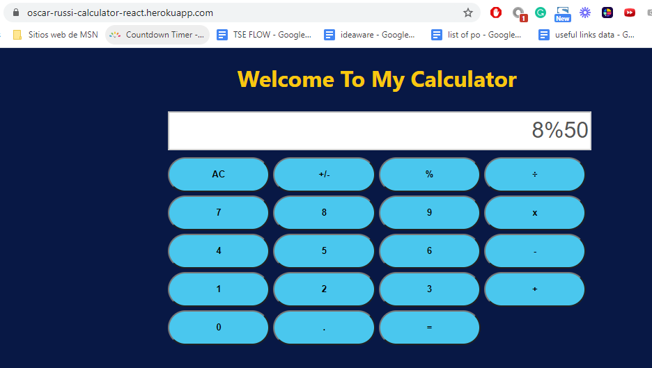

# calculator-react

Fifth milestone for the calculator React Microverse Project, By Oscar Russi

# What it does

- Using class component for the App component
- Using setState to dynamically update the attributes
- Using this.state for the variables in App.js
- Passing function to update values of the parent component

# Build with

- [React](https://reactjs.org/)
- [Webpack](https://webpack.js.org/)
- [npm](https://www.npmjs.com/)
- [Heroku](https://www.heroku.com/)

# Live demo

[Live Demo](https://oscar-russi-calculator-react.herokuapp.com/)

# How to run this project

- Download this project or install running the next command in the terminal: https://github.com/andresporras3423/calculator-react.git
- Move to the folder calculator-react
- In the terminal, run: npm install
- In the terminal, run: npm start

#### and deployed to GitHub

## Authors

**Oscar Russi**
- Github: [@andresporras3423](https://github.com/andresporras3423/)
- Linkedin: [Oscar Russi](https://www.linkedin.com/in/oscar-andres-russi-porras)

## � Contributing

This is a project for educational purposes only. We are not accepting contributions.

## Attributions and Credit

Special thanks to Microverse, for this learning opportunity. 

## Show your support

Give a ⭐️ if you like this project!

## Enjoy!