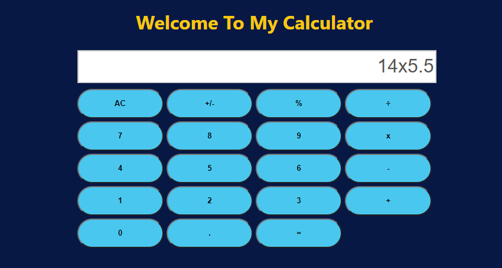

# calculator-react

First milestone for calculator react Microverse Project, By Oscar Russi

# What it does

- Initial config for calculator project
- remove unnecessary files after npx create-react-app 
- add linters
- add prop-types and big.js packages
- deployment in Heroku

# Build with

- React
- Webpack
- npm
- Heroku (for deployment)

# Live demo

[Live Demo](https://oscar-russi-calculator-react.herokuapp.com/)

# How to run this project

- Download this project or install running the next command in the terminal: https://github.com/andresporras3423/calculator-react.git
- Move to the folder calculator-react
- In the terminal, run: npm install
- In the terminal, run: npm start

#### and deployed to GitHub

## Authors

**Oscar Russi**
- Github: [@andresporras3423](https://github.com/andresporras3423/)
- Linkedin: [Oscar Russi](https://www.linkedin.com/in/oscar-andres-russi-porras)

## � Contributing

This is a project for educational purposes only. We are not accepting contributions.

## Attributions and Credit

Special thanks to Microverse, for this learning opportunity. 

## Show your support

Give a ⭐️ if you like this project!

## Enjoy!